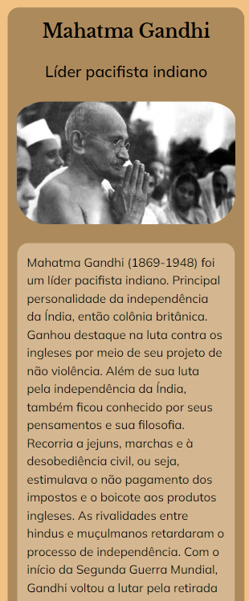

🚧***Under Construction***🚧

## 

## Tribute_Page - Responsive Website
* A tribute page made as a task to conclude the "Responsive Web Design" course from FreeCodeCamp.
* Developed first with the Mobile First methodology, then for desktop.
* Compatible with all mobile devices and with a beautiful and pleasant user interface.

## Technology 

Here are the technologies used in this project.

* HTML5
* CSS3

## Services Used

* Github
* Netlify

## Links
  - Deploy on Netlify: 
  - Repository: https://github.com/decobaccili/Tribute_Page

## Template

*No template

## Versioning

  1.0.0.0

## Authors

  * **André Baccili** 

  Please follow github and join us!
  Thanks to visiting me and good coding!

  
